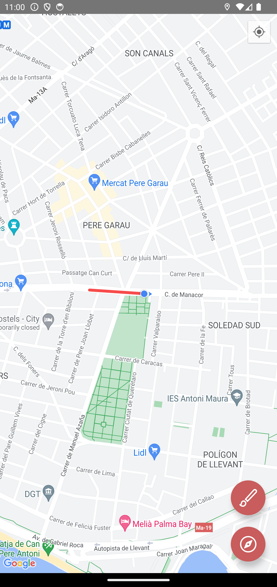
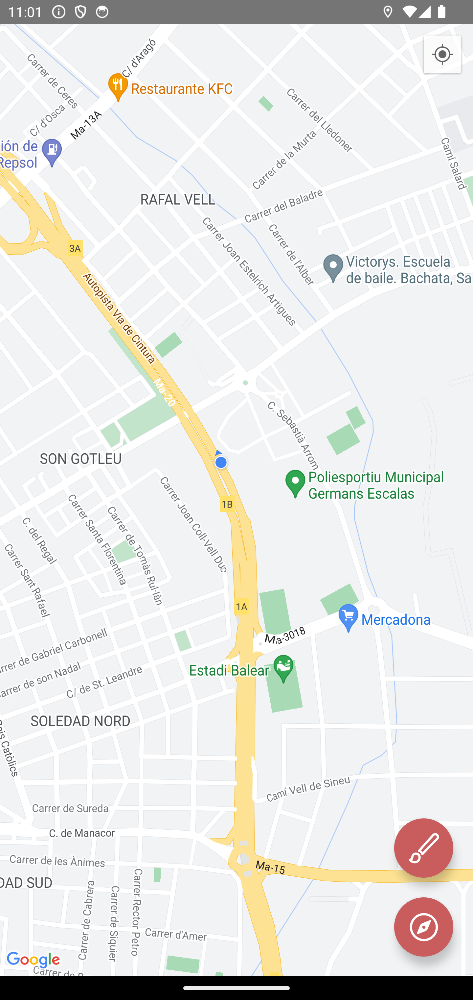
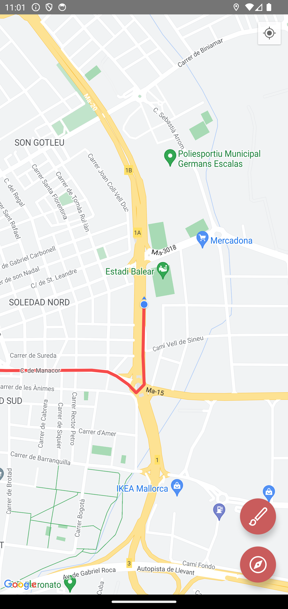
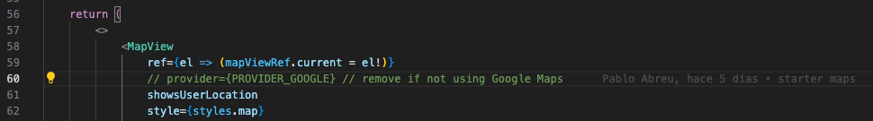
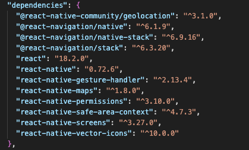

## 🚧 - Proyecto base de trabajo con Mapas y rutas en React Native 🚗 🗺️ 📍

Con esta base se puede continuar agregando funcionalidades..

`Funciones actuales:`

-   Analizar y requerir permisos para acceder a la localización
-   Seguir al dispositivo en el mapa
-   Mover el mapa manualmemte y dejar de seguir al dispositivo
-   Botón para centrar y continuar el seguimiento del sispositivo
-   Botón para activar o desactivar el trayecto recorrido

`...más funciones pronto ✨`

## Vista previa

&nbsp; &nbsp;
&nbsp; &nbsp;
&nbsp; &nbsp;

## Desarrollo

Para habilitar el uso de Google Maps en iOS(al estar comentada la línea usa el mapa de iOS por defecto) descomentar la línea 60:

### Versiones

## Más links de interés

-   [React Native](https://reactnative.dev) - React Native.
-   [React Native Maps](https://github.com/react-native-maps/react-native-maps#readme) - la documentación de la biblioteca react-native-maps.
-   [Ionicons](https://ionic.io/ionicons) - la documentación oficial de Ionicons.
